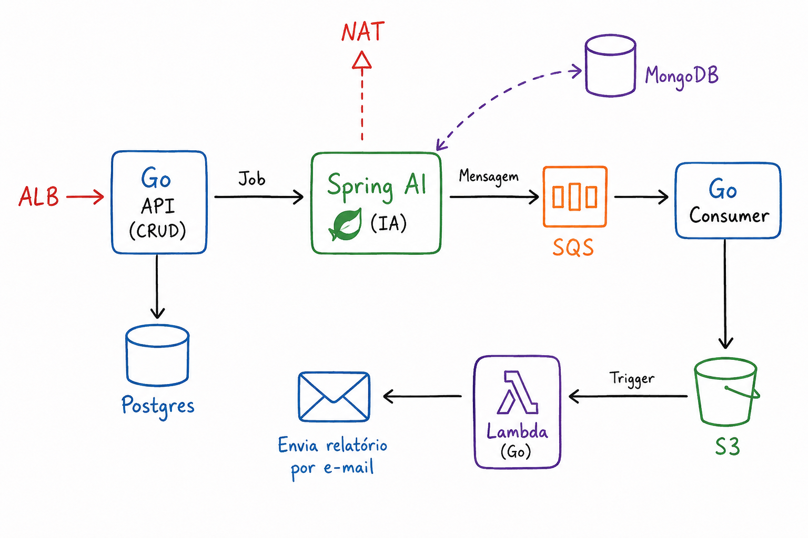

# Insight AI (InsightFlow)

Plataforma de geração automática de relatórios de RH usando IA. O sistema coleta periodicamente os dados de funcionários (nome, idade e tarefas), envia essas informações para um modelo de linguagem (LLM) gerar um relatório gerencial em português, armazena o relatório em PDF e o envia por e-mail aos destinatários — tudo de forma assíncrona, orquestrado por filas e eventos na AWS.

## Arquitetura



O fluxo de ponta a ponta funciona assim:

1. **Go API (CRUD)** — exposta atrás de um **ALB**, expõe endpoints para cadastro e consulta de funcionários, persistindo os dados no **Postgres**.
2. **Spring AI (IA)** — em um **job agendado (scheduler)**, busca a lista de funcionários na Go API, monta um prompt e usa um modelo de linguagem (via Spring AI / OpenAI, com saída para a internet através de um **NAT**) para gerar um relatório textual. O relatório é salvo no **MongoDB** e a mensagem é publicada em uma fila **SQS**.
3. **Go Consumer** — consome as mensagens da fila SQS, gera um arquivo **PDF** a partir do texto do relatório e faz o upload desse PDF para um bucket **S3**.
4. **Lambda (Go)** — é **disparada (trigger)** pelo evento de novo objeto no S3, baixa o PDF e **envia um e-mail** com o relatório em anexo via Amazon SES.

## Componentes

| Projeto | Linguagem / Stack | Responsabilidade |
|---|---|---|
| [`go-crud-ms`](go-crud-ms) | Go + Gin + GORM + Postgres | API CRUD de funcionários (cadastro e listagem) |
| [`spring-ai-ms`](spring-ai-ms) | Java 21 + Spring Boot + Spring AI + MongoDB | Job agendado que consulta os funcionários, gera o relatório com IA, persiste no MongoDB e publica na fila SQS |
| [`go-consumer`](go-consumer) | Go + Watermill (SQS) + MinIO/S3 | Consome a fila SQS, gera o PDF do relatório e faz upload para o S3 |
| [`go-lambda`](go-lambda) | Go + AWS Lambda | Disparada por eventos do S3, baixa o PDF e envia por e-mail via Amazon SES |

### go-crud-ms

API REST de gerenciamento de funcionários.

- **Stack**: Go, [Gin](https://gin-gonic.com/), [GORM](https://gorm.io/) com driver Postgres.
- **Endpoints** (`/api/v1/employees`):
  - `POST /` — cadastra um funcionário (`name`, `age`, `tasks`).
  - `GET /` — lista os funcionários cadastrados.
- **Persistência**: PostgreSQL, com auto-migração do schema `Employee` (nome, idade, flag de tarefa concluída e lista de tarefas).
- **Variáveis de ambiente**: `PORT`, `DB_HOST`, `DB_PORT`, `DB_USER`, `DB_PASSWORD`, `DB_NAME`.

### spring-ai-ms

Microsserviço responsável por gerar os relatórios com IA.

- **Stack**: Java 21, Spring Boot, Spring AI (OpenAI), Spring Cloud OpenFeign, Spring Data MongoDB, AWS SDK (SQS).
- **Fluxo do job** (`JobRelatorioScheduler` → `RelatorioJobService`, executado via `@Scheduled` com cron configurável):
  1. Busca a lista de funcionários e tarefas via Feign (`EmployeeClient`) na `go-crud-ms`.
  2. Monta um prompt em português e solicita ao modelo de IA (configurado via Spring AI/OpenAI) a geração de um relatório gerencial em texto corrido.
  3. Persiste o relatório gerado como `RelatorioDocument` no **MongoDB** (coleção `relatorios`).
  4. Publica uma mensagem (`RelatorioMensagem`) com o texto do relatório na fila **SQS**.
- **Variáveis de ambiente**: `MONGODB_URI`, `OPENAI_API_KEY`, `OPENAI_CHAT_MODEL`, `RELATORIO_SCHEDULER_CRON`, `EMPLOYEE_API_URL`, `AWS_REGION`, `SQS_QUEUE_NAME`, `SQS_ENDPOINT`.

### go-consumer

Consumidor da fila de mensagens que transforma os relatórios em PDF e os armazena.

- **Stack**: Go, [Watermill](https://watermill.io/) (subscriber para SQS), geração de PDF (`seehuhn.de/go/pdf`), cliente S3/MinIO (`minio-go`).
- **Fluxo**:
  1. Assina (subscribe) a fila SQS configurada e recebe mensagens com o texto do relatório.
  2. Gera um arquivo PDF a partir do texto (`PDFService`).
  3. Faz upload do PDF para um bucket S3/MinIO (`MinioStorage`, via interface `Storage`).
  4. Confirma (`Ack`) ou rejeita (`Nack`) a mensagem conforme o resultado do processamento.
- **Variáveis de ambiente**: `AWS_REGION`, `AWS_ACCESS_KEY_ID`, `AWS_SECRET_ACCESS_KEY`, `SQS_QUEUE_NAME`, `S3_ENDPOINT`, `S3_BUCKET`, `S3_USE_SSL`.

### go-lambda

Função AWS Lambda que envia o relatório por e-mail.

- **Stack**: Go, AWS Lambda (`aws-lambda-go`), AWS SDK v2 (S3 e SES v2).
- **Fluxo**:
  1. É acionada por um evento de criação de objeto no bucket S3 (`events.S3Event`).
  2. Baixa o PDF correspondente do S3.
  3. Envia um e-mail com o PDF em anexo via Amazon SES (`sesv2`).
- **Variáveis de ambiente**: `SENDER_EMAIL`, `RECIPIENT_EMAIL`.

## Infraestrutura local (`docker-compose.yml`)

O `docker-compose.yml` na raiz do projeto sobe a infraestrutura de apoio para desenvolvimento local:

- **postgres** (porta `5432`) — banco de dados da `go-crud-ms`.
- **pgadmin** (porta `5050`) — interface de administração do Postgres.
- **mongodb** (porta `27017`) — banco de dados da `spring-ai-ms`.
- **mongo-express** (porta `8081`) — interface de administração do MongoDB.

Para subir a infraestrutura local:

```bash
docker compose up -d
```

> Os serviços de fila (SQS), armazenamento de objetos (S3) e envio de e-mail (SES) são serviços AWS — em desenvolvimento local é possível substituí-los por equivalentes (ex.: LocalStack/MinIO) configurando os endpoints via variáveis de ambiente (`SQS_ENDPOINT`, `S3_ENDPOINT`).

## Como executar

Cada serviço é um projeto independente, com seu próprio gerenciador de dependências:

```bash
# 1. Suba a infraestrutura local (Postgres, Mongo e interfaces de administração)
docker compose up -d

# 2. API de funcionários (Go)
cd go-crud-ms
go run main.go

# 3. Microsserviço de IA / geração de relatórios (Java/Spring Boot)
cd spring-ai-ms
./mvnw spring-boot:run

# 4. Consumer que gera o PDF e envia para o S3 (Go)
cd go-consumer
go run main.go

# 5. Lambda de envio de e-mail (Go) — implantada na AWS, disparada por eventos do S3
cd go-lambda
go build .
```

Cada serviço lê suas configurações de variáveis de ambiente (suporte a arquivos `.env` via `godotenv`/Spring). Configure as variáveis listadas na seção de cada componente antes de executar.
